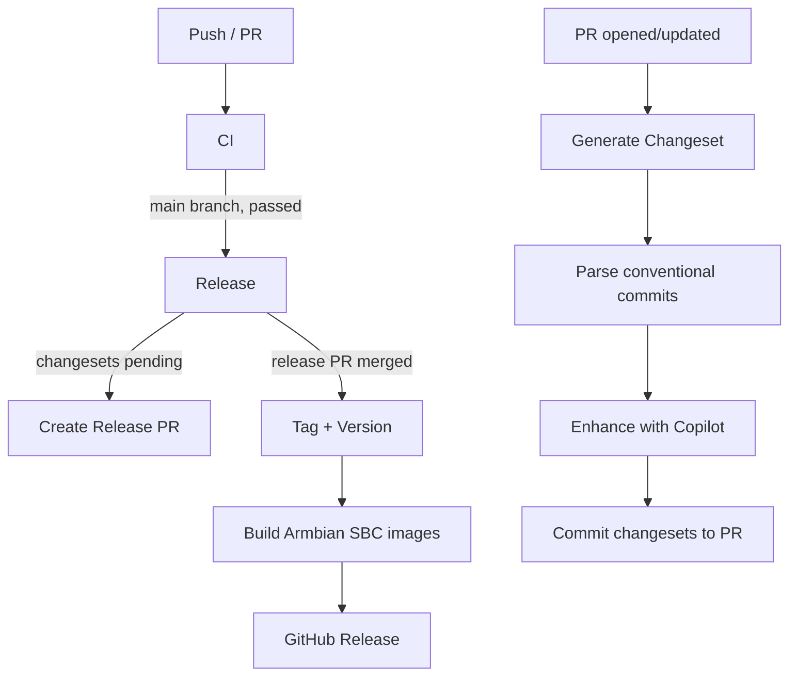
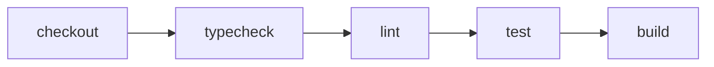
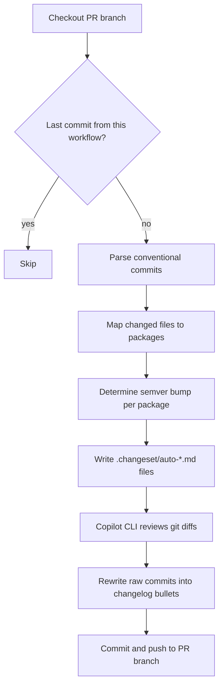
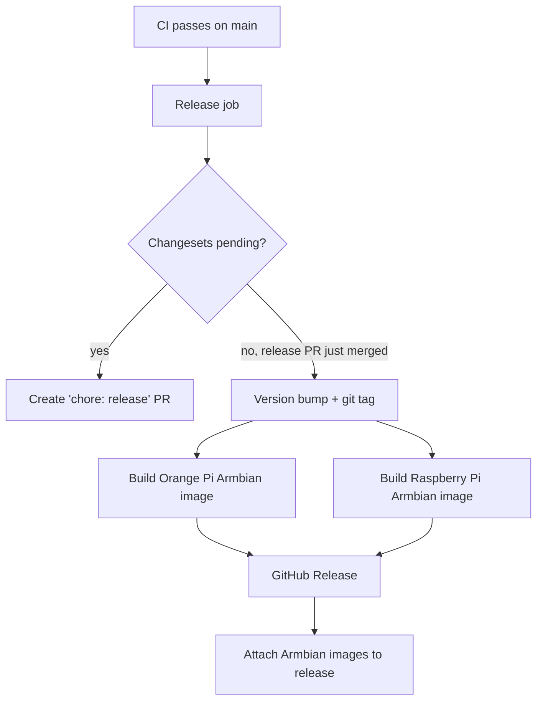
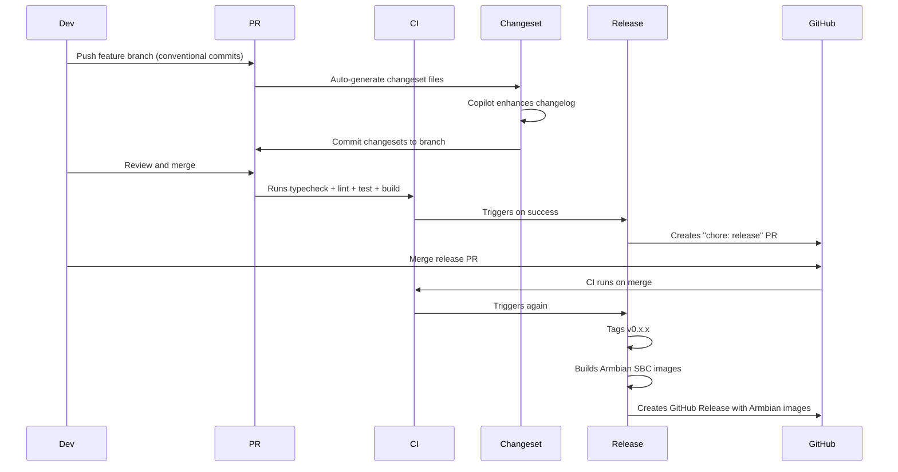

# CI/CD Workflows

## Overview

## Workflows

### `ci.yml` — Continuous Integration

Runs on every push and pull request.

- **check** job: typecheck, lint, test
- **build** job: compiles all packages (depends on check passing)

### `changeset.yml` — Auto-Generate Changelogs

Runs on PR open/update against `main`.

**Conventional commit mapping:**
- `feat:` = minor, `fix:`/`perf:`/`refactor:` = patch, `!` or `BREAKING CHANGE` = major
- `docs:`/`test:`/`ci:`/`chore:` = skipped (no changeset)

**Copilot enhancement:** The raw changeset contains commit SHAs, file lists, and diff stats. Copilot CLI reads the actual diffs via `git show`, then rewrites the body into concise user-facing changelog entries. This step is `continue-on-error` — if Copilot is unavailable, the raw commit details are kept.

**Requires:** `COPILOT_PAT` secret (GitHub PAT with Copilot access).

### `release.yml` — Release + Armbian Image Build

Runs after CI passes on `main`, or via manual dispatch.

**Three jobs:**

1. **release** — Uses `changesets/action` which has two modes:
   - If `.changeset/*.md` files exist: creates a "chore: release" PR that bumps versions and updates CHANGELOG.md
   - If that PR was just merged (no changesets left): tags the release and outputs `published=true`

2. **build-sbc** — Triggered when `published=true`. Matrix build for supported Armbian boards:
   - Compiles all Bun binaries for ARM64
   - Collects dist (binaries + hooks + dashboard + runner assets)
   - Validates all image assets present
   - Builds board-specific Armbian images for Orange Pi 5 Plus and Raspberry Pi 4/5

3. **github-release** — Downloads the Armbian image artifacts and creates a GitHub Release with only those public assets attached.

## Secrets Required

| Secret | Used by | Purpose |
|--------|---------|---------|
| `GITHUB_TOKEN` | All workflows | Auto-provided. PR creation, release creation |
| `COPILOT_PAT` | changeset.yml | GitHub PAT with Copilot access for changelog enhancement |

## Release Lifecycle

