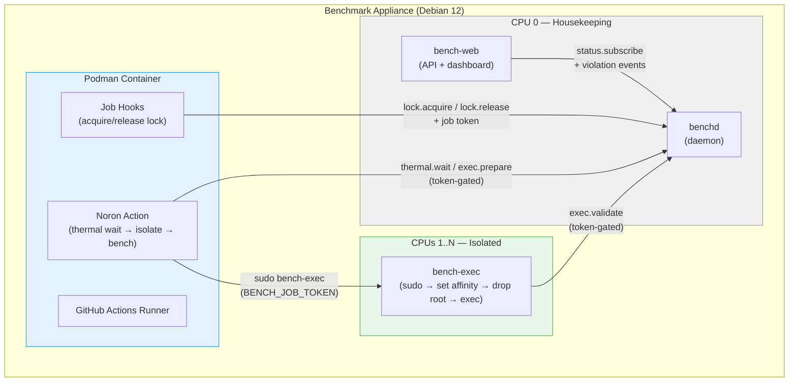

# Noron

A dedicated benchmark appliance for GitHub Actions that achieves **<0.1% variance** through hardware-level CPU isolation, thermal gating, and serial job execution. Runs on any Linux machine — SBCs, bare metal servers, or cloud VMs.

## How it works



**Core guarantees:**
- **One job at a time** — machine-wide FIFO lock prevents any contention
- **CPU isolation** — benchmark cores are invisible to the OS scheduler via `isolcpus` + cgroups v2
- **Thermal gating** — benchmarks wait for CPU temperature to stabilize before running
- **IRQ pinning** — all hardware interrupts pinned to the housekeeping core
- **Zero overhead monitoring** — dashboard and daemon run only on the housekeeping core

## Hardware requirements

| Requirement | Minimum | Recommended |
|-------------|---------|-------------|
| CPU cores | 2 (1 housekeeping + 1 benchmark) | 4+ (1 housekeeping + 3 benchmark) |
| RAM | 2 GB | 4 GB+ |
| Storage | 8 GB (SD card or SSD) | 16 GB+ SSD |
| OS | Debian 12 (bookworm) | Provided via ISO |
| Architecture | x86_64 or ARM64 (aarch64) | ARM64 SBCs: Orange Pi, Raspberry Pi 4/5 |

More cores = more isolation options. The appliance reserves 1 core for OS/daemon/web overhead and dedicates the rest exclusively to benchmarks.

## Setting up your own runner

The appliance requires dedicated hardware with a clean Debian 12 install — it configures kernel parameters (`isolcpus`, `nohz_full`, `nosmt`, etc.) that fundamentally change how the OS schedules processes. Installing on a machine you use for other things is not recommended.

### Option 1: Bootable ISO (recommended)

Flash the ISO to an SD card or USB drive and boot. The setup wizard handles everything.

Download the latest ISO from [Releases](../../releases), then flash it:

**Using [balenaEtcher](https://etcher.balena.io/) (Windows, macOS, Linux):** select the ISO, select your drive, click Flash.

**Using the command line:**
```bash
# ARM64 (Orange Pi, Raspberry Pi, etc.)
sudo dd if=benchmark-appliance-arm64.iso of=/dev/sdX bs=4M status=progress

# x64 (PC, server)
sudo dd if=benchmark-appliance-x64.iso of=/dev/sdX bs=4M status=progress
```

The setup wizard runs automatically on first boot.

> **Step-by-step deployment guide** including Orange Pi NVMe boot, hardware-specific notes, and self-update configuration: **[packages/iso/README.md](packages/iso/README.md)**

### Option 2: Ansible (fleet management)

For provisioning multiple appliances or automated repeatable deployments:

```bash
cd provisioning/ansible
ansible-playbook -i inventory.local.yml playbook.yml --ask-vault-pass
```

> **Full Ansible guide** including inventory setup, per-machine core allocation, and secrets management: **[provisioning/ansible/README.md](provisioning/ansible/README.md)**

## Setup wizard (appliance admin only)

The interactive setup wizard runs on first boot and configures the appliance. This is a one-time step for the person hosting the machine — users you invite never need to do this.

### Prerequisites

Before running the wizard, create a **GitHub OAuth App** for your appliance:

1. Go to [github.com/settings/developers](https://github.com/settings/developers) > OAuth Apps > New OAuth App
2. Fill in:
   - **Application name:** anything (e.g. "Noron")
   - **Homepage URL:** `http://<your-hostname>:9216` (or your chosen port)
   - **Authorization callback URL:** `http://<your-hostname>:9216/auth/callback`
3. Click "Register application"
4. Copy the **Client ID** and generate a **Client Secret** — you'll paste these into the wizard

If you're using Tailscale, the hostname should be your Tailscale machine name (e.g. `http://bench-box:9216`). If hosting on the public internet, use your domain or IP.

### Wizard steps

| Step | What it does |
|------|-------------|
| **Welcome** | Detects CPU cores, memory, thermal zones, network interfaces |
| **Cores** | Recommends core split (1 housekeeping + rest for benchmarks) |
| **OAuth** | Paste your GitHub OAuth App Client ID and Secret |
| **Network** | Sets hostname, optional Tailscale VPN |
| **Review** | Shows all settings for confirmation |
| **Install** | Installs packages, builds runner container, starts services |
| **Done** | Shows dashboard URL and admin invite link |

### After setup

1. **Reboot** if prompted (kernel parameters require a reboot to take effect)
2. Open the **admin invite link** shown on the Done screen (also in `journalctl -u bench-web`)
3. Sign in with GitHub — you become the first admin
4. Generate invite links for your team from the admin panel

## Inviting users

Users don't need to know anything about the appliance setup. Send them an invite link from the dashboard admin panel. They:

1. Click the invite link
2. Sign in with GitHub
3. Grant repo access (OAuth upgrade or paste a fine-grained PAT)
4. Register their repo as a benchmark target
5. Add the action to their workflow and push

## Using in GitHub Actions

Add the benchmark action to your workflow:

```yaml
jobs:
  benchmark:
    runs-on: [self-hosted, noron]
    steps:
      - uses: actions/checkout@v4
      - uses: thejustinwalsh/noron/packages/action@v0.1.0
        with:
          command: node ./bench/run.js
          target-temp: 45
```

### How `runs-on` labels work

`runs-on: [self-hosted, noron]` tells GitHub Actions to route this job to a runner that has **both** the `self-hosted` and `noron` labels. Every self-hosted runner automatically gets the `self-hosted` label. The `noron` label is applied by the Noron appliance when it registers the runner with GitHub — this happens automatically during provisioning.

This means:
- Jobs with `runs-on: [self-hosted, noron]` **only** run on your Noron appliance
- Jobs with `runs-on: ubuntu-latest` run on GitHub's shared runners as usual
- You can have both in the same repo — regular CI on GitHub runners, benchmarks on Noron

The label is configured in the runner container's environment (`RUNNER_LABELS`). The Ansible deployment also adds the machine hostname as a label (e.g., `noron,bench-opi5`) so you can target specific appliances if you have multiple.

### Runtime versions

The runner container ships with Node.js 20 and Bun as defaults. Use standard setup actions to install specific versions before your benchmark:

```yaml
steps:
  - uses: actions/checkout@v4
  - uses: actions/setup-node@v4
    with:
      node-version: 22
  - uses: oven-sh/setup-bun@v2
    with:
      bun-version: 1.2.0
  - uses: thejustinwalsh/noron/packages/action@v0.1.0
    with:
      command: bun run bench
```

Setup actions modify `PATH` before the benchmark runs. `bench-exec` preserves the full environment (including PATH changes) when executing your command with CPU isolation.

The action automatically:
1. Acquires the machine-wide lock (queues if another benchmark is running)
2. Waits for CPU temperature to reach the target
3. Pins the benchmark to isolated cores with real-time priority
4. Runs your command inside a cgroup with dedicated CPUs
5. Redirects temp I/O to tmpfs (if available) by setting `TMPDIR`
6. Releases the lock when done

### Action inputs

| Input | Default | Description |
|-------|---------|-------------|
| `command` | (required) | The benchmark command to run |
| `target-temp` | `45` | Target CPU temperature (°C) before starting |
| `cores` | (auto) | CPU cores to use. Leave empty to auto-detect from benchd |
| `timeout` | `300` | Max seconds to wait for thermal stabilization |

### Automatic tmpfs for benchmark I/O

When the appliance has tmpfs configured (4GB+ RAM), the action automatically sets `TMPDIR` to the RAM-backed mount. This means `os.tmpdir()` in Node/Bun, and any tool that writes temp files, uses RAM instead of disk — eliminating I/O variance with zero code changes.

The action logs whether tmpfs is active. On low-memory devices (<2GB) where tmpfs is skipped, a notice explains why and suggests upgrading RAM.

| Variable | Description |
|----------|-------------|
| `TMPDIR` | Automatically set to the tmpfs path when available. Standard Unix — respected by Node, Bun, and most tools. |
| `BENCH_TMPFS` | Same path, explicit. Use if you need to check whether tmpfs is active (`if [ -n "$BENCH_TMPFS" ]`). |
| `BENCH_SESSION_ID` | Unique session ID for this benchmark run |

## Architecture

### Packages

| Package | Purpose | Runtime deps |
|---------|---------|-------------|
| `packages/shared` | IPC protocol, config, CPU topology, thermal utils | none |
| `packages/benchd` | Host daemon — lock, thermal, cgroup management | none (just @bench/shared) |
| `packages/bench-exec` | Privileged executor — CPU affinity, nice, ionice | none (just @bench/shared) |
| `packages/action` | Composite GitHub Action | none (just @bench/shared) |
| `packages/web` | Hono API, dashboard serving, OAuth, invites | hono |
| `packages/dashboard` | React SPA with Web Awesome components | react, @awesome.me/webawesome |
| `packages/setup` | Ink TUI setup wizard | ink, react |
| `packages/cli` | Remote monitoring TUI | ink, react, clipanion |
| `packages/iso` | [ISO build + deployment](packages/iso/README.md) | workspace deps |
| `packages/benchmark` | Variance stability tests (mitata) | mitata |

### Performance isolation model

The system follows the [LLVM Benchmarking Guidelines](https://llvm.org/docs/Benchmarking.html) for <0.1% variance:

| Technique | Implementation |
|-----------|---------------|
| CPU isolation | `isolcpus` kernel parameter removes cores from OS scheduler |
| Tickless cores | `nohz_full` disables timer interrupts on benchmark cores |
| RCU offloading | `rcu_nocbs` moves kernel callbacks to housekeeping core |
| No hyperthreading | `nosmt` disables SMT to prevent core sharing |
| No frequency scaling | `performance` governor + turbo boost disabled |
| No ASLR | `kernel.randomize_va_space=0` for deterministic memory layout |
| No THP | Transparent huge pages disabled to prevent compaction stalls |
| IRQ pinning | All hardware interrupts forced to housekeeping core |
| Tmpfs I/O | Benchmark workloads use tmpfs to eliminate disk variance |
| Thermal gating | Benchmarks wait for stable CPU temperature before running |
| Serial execution | Machine-wide FIFO lock ensures zero contention |

### IPC protocol

All communication between components uses line-delimited JSON over a Unix domain socket (`/var/run/benchd.sock`):

| Message | Description |
|---------|-------------|
| `lock.acquire` / `lock.acquired` | Acquire machine-wide benchmark lock |
| `lock.release` / `lock.released` | Release lock, grant to next in queue |
| `thermal.wait` / `thermal.ready` | Wait for CPU temp to stabilize |
| `thermal.status` | Current temperature, history, trend |
| `exec.prepare` / `exec.ready` | Create cgroup for benchmark process |
| `exec.validate` / `exec.validated` | Validate and move process into cgroup |
| `config.get` | Query runtime configuration |
| `status.subscribe` / `status.update` | Live 1Hz status updates |

## Multi-tenant model

The system is designed for shared use:

- **Admin** sets up the appliance and generates invite links
- **Users** sign in via GitHub OAuth and register their repos
- **Runners** are per-repo — each user manages their own benchmark targets
- **Benchmarks** are serialized — all users share the same lock queue
- **Monitoring** is read-only — dashboard and CLI show live status to all authenticated users

## Development

```bash
# Install dependencies
bun install

# Type-check all packages
bun run typecheck

# Run tests
bun test packages/shared/       # unit tests
bun test tests/integration/     # integration tests

# Dev mode (individual packages)
cd packages/benchd && bun run dev
cd packages/web && bun run dev
cd packages/dashboard && bun run dev

# Build all
bun run build

# Lint
bun run lint
bun run lint:fix
```

### Building the ISO

```bash
# Build all packages and collect into packages/iso/dist/
make collect-dist ARCH=arm64   # or ARCH=x64

# Build the ISO (requires live-build on Debian/Ubuntu, or use OrbStack on macOS)
make iso ARCH=arm64
```

Turbo handles the full dependency graph — `shared` builds first, then binaries in parallel, then the iso package collects everything. See [packages/iso/README.md](packages/iso/README.md#building-from-source) for details.

## Self-updates

The appliance updates itself automatically from GitHub Releases. Configure in `/etc/benchd/config.toml`:

```toml
update_repo = "thejustinwalsh/noron"
update_auto = true
update_check_interval_hours = 1
```

Updates never interfere with running benchmarks — the update system is paused by the benchmark gate. Before applying, it backs up current binaries and auto-rolls back if health checks fail after restart. See the [iso package docs](packages/iso/README.md#self-updates) for details.

## Configuration

The appliance is configured via `/etc/benchd/config.toml`:

```toml
isolated_cores = [1, 2, 3]
housekeeping_core = 0
target_temp_c = 45
thermal_poll_interval_ms = 1000
benchmark_cgroup = "/sys/fs/cgroup/benchmark.slice"
socket_path = "/var/run/benchd.sock"

# Self-update (optional)
update_repo = "thejustinwalsh/noron"
update_auto = true
update_check_interval_hours = 1
```

Core allocation is auto-detected during setup based on your hardware:
- **1 core**: Warning — no isolation possible
- **2 cores**: 1 housekeeping + 1 benchmark
- **4 cores**: 1 housekeeping + 3 benchmark
- **8+ cores**: 1 housekeeping + rest benchmark

## License

[MIT](LICENSE)
