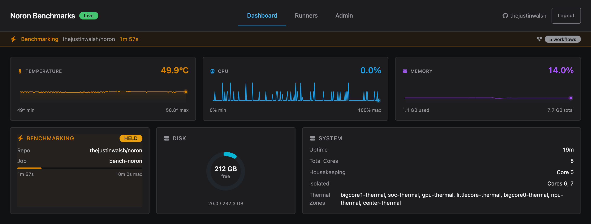
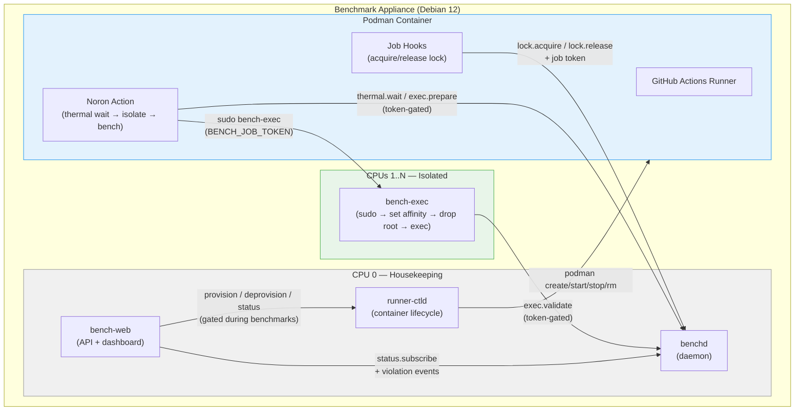

<p align="center">
  
</p>

# Noron

A dedicated benchmark appliance for GitHub Actions that achieves **~1.6% median variance** (as low as 0.08%) through hardware-level CPU isolation, thermal gating, and serial job execution. Turn any spare machine — an Orange Pi on your desk, a rack server, or a cloud VM — into a rock-solid benchmark runner that produces results you can actually trust.

## Why Noron?

- **~1.6% median variance** (as low as 0.08%) — `isolcpus`, tickless cores, IRQ pinning, and thermal gating eliminate the noise that makes benchmarks useless on shared infrastructure
- **Zero config for users** — admins set up the appliance once; everyone else just adds `runs-on: [self-hosted, noron]` to their workflow
- **One job at a time** — machine-wide FIFO lock ensures zero contention between benchmark runs
- **Self-updating** — the appliance checks GitHub Releases and updates itself automatically, with rollback on failure
- **Board-specific SBC images** — pre-built `.img` files for Orange Pi 5 Plus and Raspberry Pi 4/5, plus generic ISOs for x86_64 and ARM64 servers

## Quick start — self-hosted runner setup

### Option 1: SBC image (Orange Pi, Raspberry Pi)

Download the board-specific `.img` from the [latest release](../../releases):

| Board | Image | Notes |
|-------|-------|-------|
| Orange Pi 5 Plus | `noron-orangepi5-plus.img.xz` | RK3588, vendor kernel 6.1 LTS |
| Raspberry Pi 4/5 | `noron-rpi4b.img.xz` | RPi foundation kernel |

Flash with [balenaEtcher](https://etcher.balena.io/) or the command line:

```bash
xzcat noron-orangepi5-plus.img.xz | sudo dd of=/dev/sdX bs=4M status=progress
sync
```

Or use [balenaEtcher](https://etcher.balena.io/) which handles `.img.xz` files directly.

Boot, run the setup wizard, reboot, done. See the [deployment guide](packages/iso/README.md) for details.

### Option 2: Disk image (x86_64, generic ARM64)

For bare metal servers, cloud dedicated instances, or self-hosted hardware, download from the [latest release](../../releases):

| Platform | Image |
|----------|-------|
| x86_64 PC / server | `noron-x64.img.xz` |
| ARM64 server | `noron-arm64.img.xz` |

```bash
# Flash to disk (self-hosted hardware)
xzcat noron-x64.img.xz | sudo dd of=/dev/sdX bs=4M status=progress

# Cloud providers: decompress and upload the raw .img
unxz noron-x64.img.xz
# Then upload via provider dashboard or API
```

Works with Hetzner (`dd` from rescue), OVH (BYOI raw upload), AWS (import-image), or any provider that accepts raw disk images.

### Option 3: Ansible (fleet management)

For provisioning multiple appliances or automated repeatable deployments:

```bash
cd provisioning/ansible
ansible-playbook -i inventory.local.yml playbook.yml --ask-vault-pass
```

> **Full Ansible guide** including inventory setup, per-machine core allocation, and secrets management: **[provisioning/ansible/README.md](provisioning/ansible/README.md)**

### Option 4: LLM-assisted setup

If you have a bare metal PC or SBC and want guided help, paste the following prompt into your LLM of choice along with the hardware you're working with:

<details>
<summary>LLM setup prompt</summary>

```
I want to set up a Noron benchmark appliance (https://github.com/thejustinwalsh/noron) on a dedicated machine. Help me through the process step by step.

## What Noron is
A self-hosted GitHub Actions runner appliance optimized for low-variance benchmarking.
It uses CPU isolation (isolcpus, nohz_full, rcu_nocbs, nosmt), thermal gating, IRQ
pinning, and serial job execution to produce stable benchmark results.

## My hardware
[DESCRIBE: board/CPU model, core count, RAM, storage, architecture (x64 or arm64)]

## What I need help with

### 1. Image selection and flashing
- SBC: board-specific .img.xz from GitHub Releases (Orange Pi 5 Plus, Raspberry Pi 4/5)
- x64/arm64 server: generic .img.xz from GitHub Releases
- Flash with: xzcat <image>.img.xz | sudo dd of=/dev/sdX bs=4M status=progress

### 2. First boot and setup wizard
The setup wizard (bench-setup) runs on first login and configures:
- System passwords (bench user for SSH, root)
- Timezone
- CPU core allocation: core 0 = housekeeping (OS, daemons, dashboard), cores 1..N = isolated for benchmarks
  - ARM big.LITTLE: efficiency cores for housekeeping, performance cores for benchmarks
- GitHub OAuth App credentials (Client ID + Secret from github.com/settings/developers)
  - Homepage URL: http://<hostname>:9216
  - Callback URL: http://<hostname>:9216/auth/callback
- Hostname / public URL for dashboard access
- Optional Tailscale auth key for VPN access
- GitHub Actions runner label (default: "noron")

### 3. What the installer configures
- Kernel boot params: isolcpus=<cores> nohz_full=<cores> rcu_nocbs=<cores> nosmt
- Sysctl: ASLR off, NMI watchdog off, timer migration off, dirty ratio tuning
- CPU governor: performance (no frequency scaling)
- Turbo boost: disabled
- Transparent huge pages: disabled
- IRQ affinity: all interrupts pinned to housekeeping core
- Tmpfs mount at /mnt/bench-tmpfs for benchmark I/O (if RAM > 2GB)
- Systemd services: benchd, bench-web (port 9216), runner-ctld
- Podman container with GitHub Actions runner
- Sudoers: runner user can sudo bench-exec with SETENV

### 4. Post-setup verification
After reboot, verify:
- cat /proc/cmdline | grep isolcpus
- systemctl status benchd bench-web runner-ctld
- curl http://localhost:9216/health
- ls -la /run/benchd/benchd.sock

### 5. Dashboard and runner registration
- Open dashboard at http://<hostname>:9216 with the bootstrap invite URL shown after setup
- Sign in with GitHub OAuth to become admin
- Add a runner: provide a GitHub repo and runner registration token
- Use in workflows with: runs-on: [self-hosted, noron]

### 6. Network requirements
- Inbound: port 9216 (dashboard + OAuth callback)
- Outbound: GitHub API, Docker Hub, apt repos, optional Tailscale

Help me choose the right image for my hardware, walk me through the setup wizard
decisions, and verify everything is working after reboot.
```

</details>

## Using in GitHub Actions

Add the benchmark action to your workflow:

```yaml
jobs:
  benchmark:
    runs-on: [self-hosted, noron]
    steps:
      - uses: actions/checkout@v4
      - uses: thejustinwalsh/noron/packages/action@v0.1.0
        with:
          command: node ./bench/run.js
```

The action automatically:
1. Acquires the machine-wide lock (queues if another benchmark is running)
2. Waits for CPU temperature to reach the target
3. Pins the benchmark to isolated cores with real-time priority
4. Runs your command inside a cgroup with dedicated CPUs
5. Redirects temp I/O to tmpfs (if available) by setting `TMPDIR`
6. Releases the lock when done

### Action inputs

| Input | Default | Description |
|-------|---------|-------------|
| `command` | (required) | The benchmark command to run |
| `target-temp` | `0` (auto) | Target CPU temperature (C) before starting. `0` uses the idle baseline from benchd |
| `cores` | (auto) | CPU cores to use. Leave empty to auto-detect from benchd |
| `timeout` | `300` | Max seconds to wait for thermal stabilization |
| `use-tmpfs` | `true` | Set `TMPDIR` to the tmpfs mount. Set to `false` to disable |
| `perf-stat` | `false` | Collect hardware performance counters via `perf stat`. Reports isolation health (context switches, CPU migrations) and cache/branch/IPC metrics |

#### Action outputs

| Output | Description |
|--------|-------------|
| `perf-stat-json` | Path to perf stat JSON results (only set when `perf-stat: true`) |

### Environment variables

When the action runs your command, these variables are available:

| Variable | Description |
|----------|-------------|
| `TMPDIR` | Automatically set to the tmpfs path when available. Standard Unix — respected by Node, Bun, and most tools |
| `BENCH_TMPFS` | Same path, explicit. Use if you need to check whether tmpfs is active (`if [ -n "$BENCH_TMPFS" ]`) |
| `BENCH_SESSION_ID` | Unique session ID for this benchmark run |

### How `runs-on` labels work

`runs-on: [self-hosted, noron]` tells GitHub Actions to route this job to a runner with **both** labels. The `noron` label is applied automatically when the appliance registers the runner. The label name is configurable via `runner_label` in the config.

This means:
- Jobs with `runs-on: [self-hosted, noron]` **only** run on your Noron appliance
- Jobs with `runs-on: ubuntu-latest` run on GitHub's shared runners as usual
- You can have both in the same repo — regular CI on GitHub runners, benchmarks on Noron

### Runtime versions

The runner container ships with Node.js 20 and Bun. Use standard setup actions to install specific versions:

```yaml
steps:
  - uses: actions/checkout@v4
  - uses: actions/setup-node@v4
    with:
      node-version: 22
  - uses: oven-sh/setup-bun@v2
    with:
      bun-version: 1.2.0
  - uses: thejustinwalsh/noron/packages/action@v0.1.0
    with:
      command: bun run bench
```

Setup actions modify `PATH` before the benchmark runs. `bench-exec` preserves the full environment (including PATH changes) when executing your command with CPU isolation.

## Setup wizard

The interactive setup wizard runs on first boot and configures the appliance. This is a one-time step for the person hosting the machine — users you invite never need to do this.

### Prerequisites

Before running the wizard, create a **GitHub OAuth App** for your appliance:

1. Go to [github.com/settings/developers](https://github.com/settings/developers) > OAuth Apps > New OAuth App
2. Fill in:
   - **Application name:** anything (e.g. "Noron")
   - **Homepage URL:** `http://<your-hostname>:9216` (or your chosen port)
   - **Authorization callback URL:** `http://<your-hostname>:9216/auth/callback`
3. Click "Register application"
4. Copy the **Client ID** and generate a **Client Secret** — you'll paste these into the wizard

If you're using Tailscale, the hostname should be your Tailscale machine name (e.g. `http://bench-box:9216`).

### Wizard steps

On first boot, the wizard runs automatically when you log in. The default login user is `root` (SBC images) or `bench` (ISO installs).

| Step | What it does | First boot | Reconfigure |
|------|-------------|:---:|:---:|
| **Welcome** | Detects CPU cores, memory, thermal zones, network interfaces | Yes | Yes |
| **Password** | Set the `bench` user account password for SSH and console access | Yes | — |
| **Timezone** | Select your timezone (defaults to UTC) | Yes | — |
| **Cores** | Recommends core split (1 housekeeping + rest for benchmarks). Detects big.LITTLE topology on ARM SBCs | Yes | Yes |
| **OAuth** | Paste your GitHub OAuth App Client ID and Secret | Yes | Yes |
| **Network** | Sets hostname, optional Tailscale VPN | Yes | Yes |
| **Label** | Configure the GitHub Actions runner label (default: `noron`) | Yes | Yes |
| **Review** | Shows all settings for confirmation | Yes | Yes |
| **Install** | Updates packages, writes config, builds runner container, starts services | Yes | Yes |
| **Done** | Shows dashboard URL and admin invite link, prompts to reboot | Yes | Yes |

To re-run the wizard later: `sudo bench-setup --reconfigure` (skips password and timezone).

### After setup

1. **Reboot** when prompted (kernel parameters require a reboot to take effect)
2. Log in as **bench** (the password you set during the wizard)
3. Open the **admin invite link** shown on the Done screen
4. Sign in with GitHub — you become the first admin
5. Generate invite links for your team from the admin panel

## Inviting users

Users don't need to know anything about the appliance setup. Send them an invite link from the dashboard admin panel. They:

1. Click the invite link
2. Sign in with GitHub
3. Grant repo access (OAuth upgrade or paste a fine-grained PAT)
4. Register their repo as a benchmark target
5. Add the action to their workflow and push

## How it works



**Core guarantees:**
- **One job at a time** — machine-wide FIFO lock prevents any contention
- **CPU isolation** — benchmark cores are invisible to the OS scheduler via `isolcpus` + cgroups v2
- **Thermal gating** — benchmarks wait for CPU temperature to stabilize before running
- **IRQ pinning** — all hardware interrupts pinned to the housekeeping core
- **Zero overhead monitoring** — dashboard and daemon run only on the housekeeping core

### Performance isolation model

The system follows the [LLVM Benchmarking Guidelines](https://llvm.org/docs/Benchmarking.html) for low-variance benchmarking:

| Technique | Implementation |
|-----------|---------------|
| CPU isolation | `isolcpus` kernel parameter removes cores from OS scheduler |
| Tickless cores | `nohz_full` disables timer interrupts on benchmark cores |
| RCU offloading | `rcu_nocbs` moves kernel callbacks to housekeeping core |
| No hyperthreading | `nosmt` disables SMT to prevent core sharing |
| No frequency scaling | `performance` governor + turbo boost disabled |
| No ASLR | `kernel.randomize_va_space=0` for deterministic memory layout |
| No THP | Transparent huge pages disabled to prevent compaction stalls |
| IRQ pinning | All hardware interrupts forced to housekeeping core |
| Tmpfs I/O | Benchmark workloads use tmpfs to eliminate disk variance |
| Thermal gating | Benchmarks wait for stable CPU temperature before running |
| Serial execution | Machine-wide FIFO lock ensures zero contention |

### IPC protocol

All communication between components uses line-delimited JSON over a Unix domain socket (`/run/benchd/benchd.sock`), correlated via `requestId` UUIDs:

| Message | Description |
|---------|-------------|
| `lock.acquire` / `lock.acquired` / `lock.queued` | Acquire machine-wide benchmark lock (queues if busy) |
| `lock.release` / `lock.released` | Release lock, grant to next in queue |
| `lock.status` | Query current lock state and queue depth |
| `lock.setTimeout` | Adjust timeout on an active lock |
| `thermal.wait` / `thermal.ready` / `thermal.timeout` | Wait for CPU temp to stabilize |
| `thermal.status` | Current temperature, history, trend |
| `exec.prepare` / `exec.ready` | Create cgroup for benchmark process |
| `exec.validate` / `exec.validated` / `exec.invalid` | Validate and move process into cgroup |
| `action.checkin` | Verify the GitHub Action is in use for this job |
| `config.get` | Query runtime configuration |
| `status.subscribe` / `status.update` | Live 1Hz status updates (streaming) |
| `violation.occurred` | Broadcast event for performance violations |

Token-protected messages (`lock.release`, `thermal.wait`, `exec.prepare`, `exec.validate`, `action.checkin`) require a valid `jobToken` that is issued when the lock is acquired and invalidated on release.

### Multi-tenant model

- **Admin** sets up the appliance and generates invite links
- **Users** sign in via GitHub OAuth and register their repos
- **Runners** are per-repo — each user manages their own benchmark targets
- **Benchmarks** are serialized — all users share the same lock queue
- **Monitoring** is read-only — dashboard and CLI show live status to all authenticated users

## Configuration

The appliance is configured via `/etc/benchd/config.toml`. The setup wizard generates this file; you can also edit it directly.

```toml
# CPU allocation
isolated_cores = [1, 2, 3]
housekeeping_core = 0

# Thermal gating
target_temp_c = 45
thermal_margin_c = 3
thermal_baseline_settling_s = 30
thermal_poll_interval_ms = 1000
thermal_timeout_ms = 300000
thermal_history_size = 300

# Isolation
benchmark_slice = "benchmark.slice"
benchmark_cgroup = "/sys/fs/cgroup/benchmark.slice"
bench_tmpfs = "/mnt/bench-tmpfs"
socket_path = "/run/benchd/benchd.sock"

# Job management
lock_disconnect_grace_ms = 5000
token_expiry_hours = 24
job_timeout_ms = 600000

# Runner
runner_label = "noron"

# Self-update (optional)
update_repo = "thejustinwalsh/noron"
update_auto = true
update_check_interval_hours = 1
```

| Key | Type | Default | Description |
|-----|------|---------|-------------|
| `isolated_cores` | `number[]` | `[1, 2, 3]` | CPU cores reserved for benchmarks |
| `housekeeping_core` | `number` | `0` | Core for OS, daemon, and web server |
| `target_temp_c` | `number` | `45` | Target CPU temperature before starting benchmarks |
| `thermal_margin_c` | `number` | `3` | Temperature margin below target for stability |
| `thermal_baseline_settling_s` | `number` | `30` | Seconds to wait for baseline temperature to settle |
| `thermal_poll_interval_ms` | `number` | `1000` | How often to poll thermal sensors |
| `thermal_timeout_ms` | `number` | `300000` | Max wait for thermal stabilization (5 min) |
| `thermal_history_size` | `number` | `300` | Ring buffer size for thermal readings |
| `benchmark_slice` | `string` | `benchmark.slice` | Systemd slice name for cgroup isolation |
| `benchmark_cgroup` | `string` | `/sys/fs/cgroup/benchmark.slice` | Cgroup v2 filesystem path |
| `bench_tmpfs` | `string` | `/mnt/bench-tmpfs` | Tmpfs mount point for benchmark I/O |
| `socket_path` | `string` | `/run/benchd/benchd.sock` | Unix domain socket path for IPC |
| `lock_disconnect_grace_ms` | `number` | `5000` | Grace period before auto-releasing lock on disconnect |
| `token_expiry_hours` | `number` | `24` | Job token validity duration |
| `job_timeout_ms` | `number` | `600000` | Max job execution time (10 min) |
| `runner_label` | `string` | `noron` | GitHub Actions runner label for `runs-on` |
| `update_repo` | `string` | `""` | GitHub repo for self-updates (empty = disabled) |
| `update_auto` | `boolean` | `true` | Automatically check and apply updates |
| `update_check_interval_hours` | `number` | `1` | How often to check for updates |

Core allocation is auto-detected during setup based on your hardware:
- **1 core**: Warning — no isolation possible
- **2 cores**: 1 housekeeping + 1 benchmark
- **4 cores**: 1 housekeeping + 3 benchmark
- **8+ cores**: 1 housekeeping + rest benchmark

## Self-updates

The appliance updates itself automatically from GitHub Releases. Configure with `update_repo`, `update_auto`, and `update_check_interval_hours` in config.toml.

Updates are **safe by design**:
- Never runs during a benchmark — waits for idle before applying
- SHA-256 verified downloads from GitHub Releases
- Full backup before every update with automatic rollback on failure
- Retry-on-failure — re-applies once before rolling back
- Health verification of all services after each apply
- Updates binaries, hooks, dashboard, runner assets, systemd units, and runner containers
- Manual rollback available via CLI or dashboard admin panel

### Runner container updates

The GitHub Actions runner container image is rebuilt weekly via a systemd timer (`bench-runner-update.timer`). The Containerfile fetches the latest runner release automatically. The rebuild acquires the benchd lock so no benchmark can start during the process; if a benchmark is already running, it skips and retries next cycle.

Manual update via CLI:
```bash
bench update              # show current version and status
bench update check        # check for updates now
bench update apply        # apply available update
bench update rollback     # rollback to previous version
bench update history      # show past updates
```

Updates can also be managed from the dashboard admin panel — check for updates, apply, or rollback with one click.

## Security

### Access control

- **Invite-only registration** — users must have a valid, unexpired invite token to create an account via GitHub OAuth. Invites are single-use, admin-generated, and revocable from the dashboard.
- **OAuth CSRF protection** — all OAuth flows (device, dashboard, invite) use random nonces as state parameters with PKCE code challenges. No user-supplied data is used as OAuth state.
- **Session cookies** — `HttpOnly`, `SameSite=Strict`, `Secure` (when HTTPS). 30-day expiry.
- **Role-based access** — first user becomes admin, subsequent users are standard. Admin-only endpoints enforce role checks.

### IPC and privilege model

- **Job tokens** — 32-byte cryptographic tokens gate all privileged IPC operations (thermal wait, exec prepare, cgroup management). Tokens are generated per lock acquisition and invalidated on release.
- **Privilege separation** — `benchd` runs as root for cgroup/CPU management, `bench-web` runs as `bench` user, runner containers run as `runner`. `bench-exec` is the only sudo-allowed binary, scoped via sudoers with `SETENV`.
- **Container isolation** — runner containers get `SYS_NICE`, `CAP_PERFMON`, and `SYS_ADMIN` capabilities (ARM64 requires `SYS_ADMIN` for `perf stat` hardware counter access). Benchmark tmpfs and hooks are bind-mounted read-only.

### Update integrity

- **SHA-256 verification** — self-update downloads are verified against checksums published alongside release archives. Updates are blocked if the checksum file is missing or the hash doesn't match.
- **Automatic rollback** — failed health checks after an update trigger automatic rollback to the previous version.

### Web hardening

- **Security headers** — all responses include `X-Frame-Options: DENY`, `Content-Security-Policy`, `X-Content-Type-Options: nosniff`, and `Referrer-Policy`.
- **CORS** — API endpoints reject cross-origin requests. The dashboard is same-origin.
- **Rate limiting** — invite, auth, runner creation, and callback endpoints are rate-limited per IP.
- **No user enumeration** — auth error messages are generic and do not reveal whether a GitHub account is registered.
- **Audit logging** — admin actions (invite creation/revocation, PAT changes) are logged with timestamps and user attribution, viewable in the admin panel.
- **Encryption at rest** — GitHub tokens and PATs are encrypted with AES-256-GCM before storage in SQLite.

## Development

```bash
# Install dependencies
bun install

# Type-check all packages
bun run typecheck

# Run tests
bun test packages/shared/       # unit tests
bun test tests/integration/     # integration tests

# Dev mode (individual packages)
cd packages/benchd && bun run dev
cd packages/web && bun run dev
cd packages/dashboard && bun run dev

# Build all
bun run build

# Lint
bun run lint
bun run lint:fix
```

### Building images

```bash
# Build all packages and collect artifacts into packages/iso/dist/
BUN_TARGET=bun-linux-arm64 bun run collect-dist   # ARM64
BUN_TARGET=bun-linux-x64 bun run collect-dist     # x64

# Build server disk images (requires root, debootstrap, or Docker)
sudo ./provisioning/img/build-img.sh arm64 packages/iso/dist/ artifacts/
sudo ./provisioning/img/build-img.sh amd64 packages/iso/dist/ artifacts/

# Build SBC images (requires Armbian build framework + Docker)
./provisioning/sbc/build-sbc-image.sh orangepi5-plus packages/iso/dist/ artifacts/
./provisioning/sbc/build-sbc-image.sh rpi4b packages/iso/dist/ artifacts/
```

See [packages/iso/README.md](packages/iso/README.md#building-from-source) for the full build process.

### Local testing with QEMU

Build and boot an SBC image locally (requires `brew install qemu mtools`):

```bash
bun run dev:emulate          # build + boot in QEMU
bun run dev:emulate:boot     # boot existing image (no rebuild)
bun run dev:emulate:fetch    # fetch latest GitHub release + boot
bun run dev:emulate:persist  # persistent mode (changes survive reboot)
```

See [dev/README.md](dev/README.md) for the full local development guide.

## Hardware requirements

| Requirement | Minimum | Recommended |
|-------------|---------|-------------|
| CPU cores | 2 (1 housekeeping + 1 benchmark) | 4+ (1 housekeeping + 3 benchmark) |
| RAM | 2 GB | 4 GB+ |
| Storage | 8 GB (SD card or SSD) | 16 GB+ SSD |
| OS | Debian 12 (bookworm) | Provided via image |
| Architecture | x86_64 or ARM64 (aarch64) | ARM64 SBCs: Orange Pi 5 Plus, Raspberry Pi 4/5 |

More cores = more isolation options. The appliance reserves 1 core for OS/daemon/web overhead and dedicates the rest exclusively to benchmarks.

## Packages

| Package | Purpose | Runtime deps |
|---------|---------|-------------|
| `packages/shared` | IPC protocol, config, CPU topology, thermal utils | none |
| `packages/benchd` | Host daemon — lock, thermal, cgroup management | none (just @noron/shared) |
| `packages/bench-exec` | Privileged executor — CPU affinity, nice, ionice | none (just @noron/shared) |
| `packages/action` | Composite GitHub Action (targets Node for runner compat) | none (just @noron/shared) |
| `packages/web` | Hono API, dashboard serving, OAuth, invites, update orchestration | hono, @zod/mini, openworkflow |
| `packages/dashboard` | React SPA with Web Awesome components | react, react-dom, @awesome.me/webawesome, @tanstack/react-query |
| `packages/setup` | Ink TUI setup wizard | ink, ink-spinner, ink-text-input, react |
| `packages/cli` | Remote monitoring TUI | ink, react, clipanion |
| `packages/iso` | [Image build + deployment](packages/iso/README.md) | workspace deps |
| `packages/benchmark` | Variance stability tests | mitata, @mitata/counters |

## License

[MIT](LICENSE)
